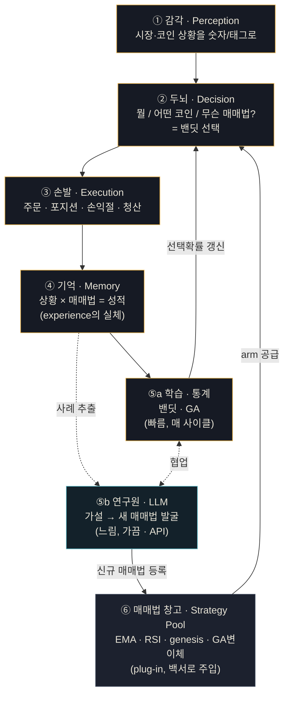
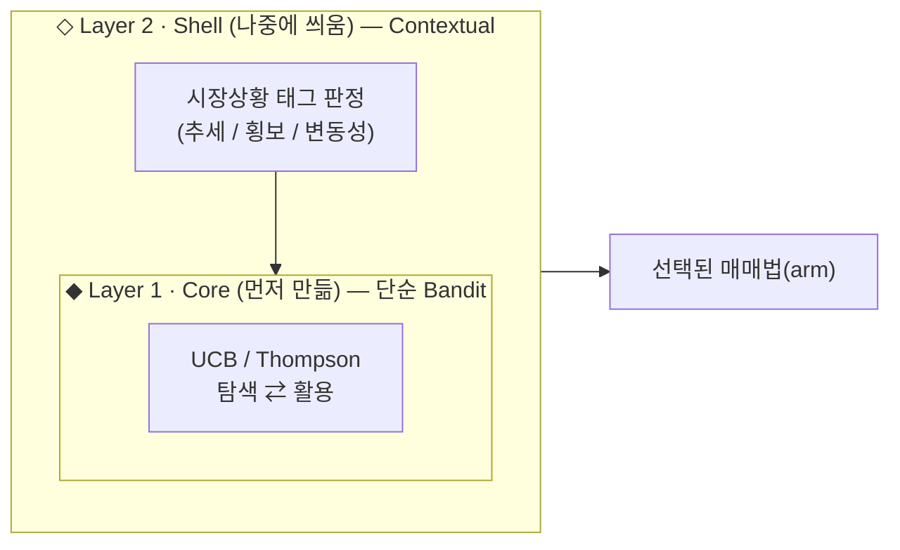
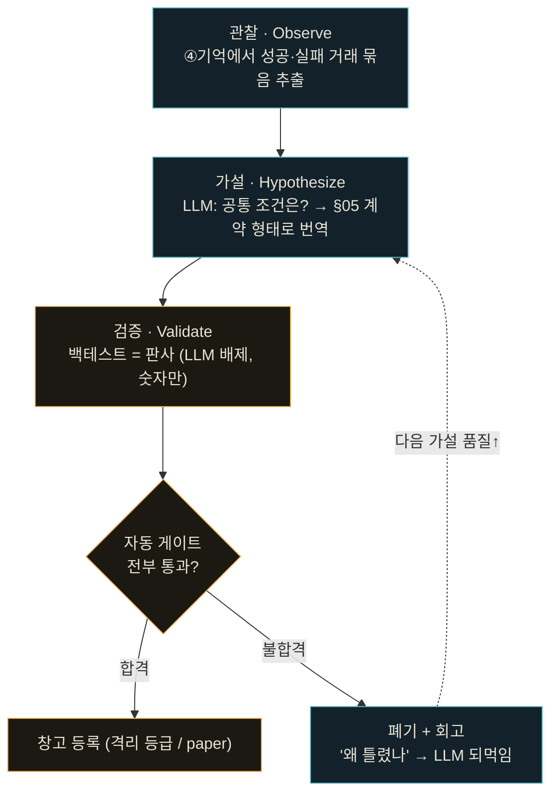

# 자율 매매 봇 설계 백서 v0.1 _(draft)_

> 사람 트레이더처럼 **"지금 뭘, 어떻게 매매할지"를 스스로 정하고**, 실패가 쌓이면 매매법 자체를 교체·탐색하는 자율 에이전트의 전체 설계도.
> 구체적 매매법은 교체 가능한 부품(plug-in)으로 분리하고, 그것을 **고르고 · 버리고 · 탐색하고 · 발굴하는 엔진**을 정의한다.

| 항목 | 값 |
|---|---|
| Version | 0.1 / draft |
| Core | Contextual Multi-Armed Bandit |
| Loop | 탐색 ⇄ 활용 (Explore / Exploit) |
| 매매법 발굴 | LLM 연구원 (Claude/GPT API) · 완전 자율 + 자동 게이트 |
| 초기 재료 | EMA + RSI (확장 예정) |
| 전략 진화 | Genetic Algorithm |

---

## § 01 — 핵심 원리

**봇은 "필요"를 정의하지 않는다. 목표가 정의하고, 봇은 잴 뿐이다.**

설계의 출발점은 닭-달걀 문제를 끊는 것이다. *"봇이 필요한 정보를 어떻게 스스로 정하나?"* 라는 무한루프는, **사람(설계자)이 목표와 평가 기준을 바깥에 고정**하는 순간 끊긴다. 봇 내부에는 정의가 없다. 오직 주어진 자(尺度)로 재고, 결과를 경험으로 쌓고, 더 나은 부품을 고를 뿐이다.

> 메모의 무한루프 — **"실패 → 다른 방법 채택 → 탐색 → 반복"** — 은 버그가 아니라 정답 구조다.
> 이것이 강화학습·밴딧 이론의 **Exploration–Exploitation Loop** 그 자체이며, 본 백서는 그 루프를 봇의 심장으로 박는다.

---

## § 02 — 전체 아키텍처

봇은 6개의 큰 덩어리로 이루어진다. 핵심 루프는 **감각 → 두뇌 → 손발 → 기억 → 학습**이며, 학습이 두뇌의 다음 선택을 바꾸면서 루프가 닫힌다.



**메모 ↔ 모듈 매핑**

| 메모에 쓴 말 | 들어가는 모듈 |
|---|---|
| "현 코인상황은 어떻고" | ① 감각 |
| "뭘하지=매매 / 어떤 매매 / 무슨 매매법" | ② 두뇌 |
| 매매법 고르고 버리고 탐색 (bandit) | ② + ⑤a |
| "탐색에서 매매법을 직접 찾고 분석" | ⑤b 연구원 (LLM) |
| "몇 번 실패하면 다른 방법 채택" | ⑤a가 ④기억 보고 ②를 바꿈 |
| "genesis 매매법은 백서로 나중에" | ⑥ 창고에 끼우는 부품 |

---

## § 02-1 — 모듈 명세

### ① 감각 (Perception)
| | |
|---|---|
| **입력** | 거래소 실시간/과거 OHLCV, 호가, 거래량 |
| **출력** | 정규화된 지표값 + 시장상황 태그(추세/횡보/변동성) |
| **기술** | ccxt · pandas/numpy · TA 지표 엔진 · *(P2)* HMM·클러스터링 |
| **근거** | 봇의 눈. 원시 가격을 판단 가능한 숫자·태그로 변환. P1은 지표값만, P2에서 상황 태그 추가. |

### ② 두뇌 (Decision)
| | |
|---|---|
| **입력** | 감각의 상황 태그 + 지표값, 기억의 성적표 |
| **출력** | 선택된 매매법(arm) + 그 매매법의 주문 의도 |
| **기술** | Multi-Armed Bandit · UCB/Thompson · ε-greedy |
| **근거** | "무슨 매매법?"의 답이 곧 밴딧 선택. 활용(검증된 최선)과 탐색(안 써본 것)을 저울질. |

### ③ 손발 (Execution)
| | |
|---|---|
| **입력** | 두뇌의 주문 의도(방향·진입·손익절선) |
| **출력** | 체결 결과, 포지션 상태, 청산 시 손익 |
| **기술** | 거래소 주문 API · 포지션 매니저 · 손익절 감시 루프 · **2% 리스크 가드** |
| **근거** | 하드 리스크 가드를 박아 어떤 매매법이든 계좌를 한 방에 못 죽이게. |

### ④ 기억 (Memory)
| | |
|---|---|
| **입력** | 매 거래의 (상황, 매매법, 보상) |
| **출력** | 상황×매매법 격자의 누적 성적 (다음 선택의 근거) |
| **기술** | 상황×전략 격자 · posterior/통계 · TimescaleDB 영속화 |
| **근거** | **experience의 실체.** §03 격자가 이 모듈의 자료구조. |

### ⑤a 학습 · 통계 (Statistical)
| | |
|---|---|
| **입력** | 기억의 격자, 각 매매법의 보상 추세 |
| **출력** | 갱신된 선택 확률, 도태/변이된 매매법 |
| **기술** | 밴딧 업데이트 · Genetic Algorithm · 적합도 평가 |
| **근거** | 빠른 학습. **닫힌 창고 안**에서 고르고 섞음. "왜 되는지"는 모르고 숫자만 본다. |

### ⑤b 연구원 · LLM (Hypothesis)
| | |
|---|---|
| **입력** | 기억의 성공·실패 거래 묶음, 폐기된 가설 회고 |
| **출력** | §05 계약 형태의 **신규 매매법 후보** + 근거(자연어) |
| **기술** | Claude/GPT API · 가설→규칙 번역기 · 비동기 트리거 · 폐기 회고 버퍼 |
| **근거** | 느린 학습. "왜 되나/왜 죽었나"를 분석해 **새 매매법 자체를 발굴.** 비싸고 느려 N건 누적·연속실패 시에만 비동기 호출. *제안만* 하고 판결은 §06 게이트. |

### ⑥ 매매법 창고 (Strategy Pool)
| | |
|---|---|
| **입력** | plug-in 계약(§05)을 지키는 매매법 정의 |
| **출력** | 두뇌가 호출 가능한 arm 집합 |
| **기술** | Strategy 인터페이스 · EMA·RSI(초기) · genesis(백서 주입) · GA변이체 |
| **근거** | 교체 가능한 부품 상자. 엔진과 분리돼 **새 매매법을 코드 수정 없이** 끼움. |

---

## § 03 — 핵심 엔진: 밴딧 층 (단순 → Contextual)

②두뇌와 ⑤학습 사이에서 도는 엔진이 곧 **Multi-Armed Bandit**이다. 매매법 하나하나가 "팔(arm)"이고, 봇은 매 순간 어떤 팔을 당길지 고른다.

핵심은 단순 밴딧을 **코어**로 두고, "시장 상황"을 보는 능력을 **껍질**로 감싸는 것 — 코어를 다시 짜지 않고 진화시킨다.



- **Layer 1 (Core):** 상황 무시. "전체적으로 성적 좋은 매매법"을 고름. 누적 보상만 기억, UCB/Thompson으로 탐색·활용 균형. **실패 시 자동 도태가 수학적으로 내장.**
- **Layer 2 (Shell):** 먼저 상황 태그를 보고, **그 상황 안에서만** 코어 밴딧을 돌림. 메모의 *"현황에서는 ema는 맹신, rsi 참고"* 가 이 층.

→ **Phase 1**은 상황 무시 코어만 빠르게 검증, **Phase 2**에서 상황 인식을 얹어 정교화 (코어 코드는 그대로).

**한 사이클 (pseudo)**

```python
# ──────────── 봇의 한 호흡 (1 cycle) ────────────
ctx   = perception.read()        # ① 시장상황 태그 + 지표값
arm   = bandit.select(ctx)       # ② 상황에 맞는 매매법 선택 (탐색 or 활용)
order = arm.decide(ctx)          # 매매법 부품이 주문 의도 생성
trade = execution.run(order)     # ③ 실행 → 포지션 → 청산
r     = evaluate(trade)          # 보상: 안 죽고 벌었나 (MDD 반영)
memory.update(ctx, arm, r)       # ④ 경험 누적
bandit.learn(ctx, arm, r)        # ⑤a 다음 선택 확률 갱신 → 루프
```

---

## § 04 — 기억 모델: experience의 실체는 표 한 장

봇의 기억은 **상황 × 매매법** 격자다. 각 칸엔 누적 성적(승률·손익·시도횟수)이 들어가고, 봇은 "지금 어느 행?"을 보고 그 행에서 가장 센 열을 꺼낸다.

| 시장상황 \ 매매법 | EMA 추종 | RSI 역추세 | genesis |
|---|---|---|---|
| 추세장 | **+12%** · 8승2패 | −3% | +5% |
| 횡보장 | −8% | **+9%** | −2% |
| 변동성 폭발 | `? 미탐색` | −15% | **+20%** |

> 행 = ①감각의 상황 태그 · 열 = ⑥창고의 매매법 · 칸 = ④기억의 누적 보상 · `?` = ⑤a의 탐색 대상

**"다른 방법 채택"을 따로 if문으로 짤 필요가 없다.** 칸 숫자가 나빠지면 선택기가 자연히 덜 고른다. 한 행이 전부 마이너스면 학습이 새 매매법을 추가한다 (⑤a는 변이로, ⑤b는 발굴로). 도태와 진화가 데이터로 일어난다.

---

## § 05 — 플러그인 계약: genesis를 끼울 자리

매매법이 EMA든 genesis든, 엔진 입장에선 **똑같이 생긴 블랙박스**여야 한다. 그래야 새 매매법을 코드 수정 없이 끼운다.

```typescript
interface Strategy {           // 매매법 부품이 지켜야 할 계약
  id: string                   // 이름표 (예: "genesis_v1")
  params: object               // 내부 파라미터 — 백서에서 주입

  decide(ctx): {               // 입력: 시장상황 + 지표값
    action: "enter" | "hold" | "exit"
    side:   "long" | "short"
    tp:     number             // 익절선
    sl:     number             // 손절선
  }                            // 출력: 주문 의도

  fitness_hint?(): number      // (선택) 자기 평가 보조 신호
}
```

> **왜 이렇게?** 엔진은 `decide()` 안에서 뭐가 일어나는지 몰라도 된다. 호출하고 결과만 받는다. 이 한 겹의 추상화가 "매매법은 나중에 백서로 준다"를 가능하게 하는 핵심 지점이다.

---

## § 06 — 연구원 루프 (5b): 매매법을 스스로 발굴

통계 학습(5a)은 **닫힌 창고 안**에서만 최적화한다 — 기존 매매법을 고르고 섞을 뿐. 5b는 그 벽을 넘는다. **Claude/GPT API**가 연구원이 되어 거래 기록을 분석하고 "왜 되는지" 가설을 세워 **매매법 자체를 발굴**한다.



> ⚖ **LLM은 제안자, 백테스트가 판사.** LLM이 아무리 그럴듯해도 통계 검증을 못 넘으면 폐기된다. 이 댐이 LLM 환각을 막는 핵심 안전장치다.

**되먹임이 곧 학습** — 폐기된 가설의 "왜 틀렸나" 회고를 다음 호출 컨텍스트에 넣으면 가설 품질이 오른다. 봇이 **연구하는 법 자체를 학습**하는 부분으로, 단순 변이(GA)와 결정적으로 다르다.

**연구 사이클 (pseudo, 비동기)**

```python
async def research_cycle():
    if not (누적거래 >= N or 연속실패_감지):    # 가끔만 깨움 (비용↓)
        return
    cases = memory.sample(wins, losses, 최근회고)
    hypo  = llm_api.ask(cases)               # Claude/GPT: 가설 + 매매법 후보(규칙)
    cand  = to_strategy(hypo)                # §05 계약 형태로 번역
    score = backtest(cand, 격리데이터)         # 판사 = 숫자 (LLM 배제)
    if score.passes_all_gates():             # §06 자동 게이트 ↓
        pool.register(cand, tier="paper")    # 완전 자율 등록 (격리 등급)
    else:
        memory.log_failure(hypo, score)      # 회고 → 다음 가설 품질↑
```

### ⚠ "완전 자율"의 진짜 의미 — 사람은 빠지되 게이트는 더 빡세게

사람 승인이 없으므로, LLM이 만든 매매법이 실거래 자본에 닿기 전 **반드시 자동 게이트를 전부 통과**해야 한다. 게이트가 곧 사람의 대역이다.

1. **표본 외 검증** (out-of-sample) — 학습에 안 쓴 기간에서도 되는가
2. **워크포워드 통과** — 시간 굴려가며 반복 검증
3. **통계 유의성 임계** — 운빨/과최적화 거름
4. **격리 페이퍼트레이딩 N일** — 실시간 모의로 생존 확인
5. **자본 상한** — 승급해도 소액부터
6. **이상감지 킬스위치** — 이상 손실 시 즉시 격리로 강등

> 신규 매매법은 곧장 실거래에 안 들어가고 **격리(paper) 등급**으로 등록된다. 시뮬·페이퍼에서 충분히 살아남아야 실자본 등급으로 승급. → **자율이되 안전한 자율.**

---

## § 07 — 보상 설계: "많이 번 놈"이 아니라 "안 죽고 번 놈"

보상 함수가 전부다. 단순 수익률로 재면 밴딧은 **한 방 운빨 전략**(10배 먹고 다음에 청산되는 도박꾼)을 챔피언으로 뽑는다. 그래서 낙폭으로 나눈다 — **2% 리스크 룰** 정신을 수식에 박는 것.

```python
reward = 순손익 / 최대낙폭(MDD)          # 적게 잃으며 번 놈 우대
       * 시도횟수_충분(arm)              # 3번 하고 운 좋은 놈 거름
       - 청산_페널티                     # -50% 같은 사망은 강한 음수
```

> ⚠ **Reward Hacking 경고** — 평가 기준(목표·리스크 한도)은 **반드시 봇 바깥에 사람이 고정**한다. 봇이 자기 평가지표를 스스로 정하게 두면 자기한테 유리하게 왜곡해 "장부상 천재·실전 즉사" 봇이 된다. 봇은 정의하지 않고 잴 뿐 — §01 원칙이 여기서 안전장치가 된다.

---

## § 08 — 구현 로드맵

학습은 **수천 번의 실패**를 먹어야 일어난다. 그 실패를 실거래로 하면 계좌가 먼저 죽는다. 그래서 순서가 곧 안전장치다.

| Phase | 이름 | 내용 |
|---|---|---|
| **0** | 인프라 | ccxt로 OHLCV 수집 → TimescaleDB → 시뮬레이터 구축. (기존 백테스트 프레임워크가 토대) |
| **1** | 코어 | 상황 무시 단순 밴딧 + EMA·RSI 2개. 시뮬에서 수만 번 죽이며 **루프의 심장이 뛰는지** 검증 |
| **2** | 껍질 | ①감각에 상황 태깅(클러스터링/HMM) 추가 → contextual 밴딧. §04 격자 채워짐 |
| **3** | 진화 | ⑤a에 GA 변이 + ⑤b **LLM 연구원** 가동. genesis 매매법도 부품으로 합류 |
| **4** | 실전 | 시뮬·페이퍼 생존 챔피언만 소액 실거래 → 견디면 자본 점증. **역순 절대 금지** |

---

_본 문서는 아키텍처 골격을 정의한다. 구체적 매매법(genesis 등)은 별도 백서에서 §05 plug-in 계약에 맞춰 정의해 ⑥창고에 주입한다._
